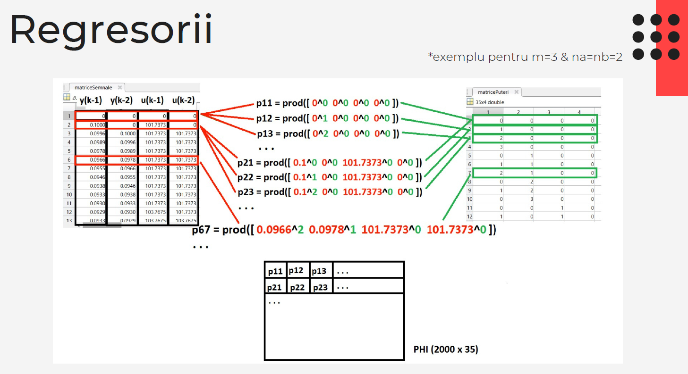
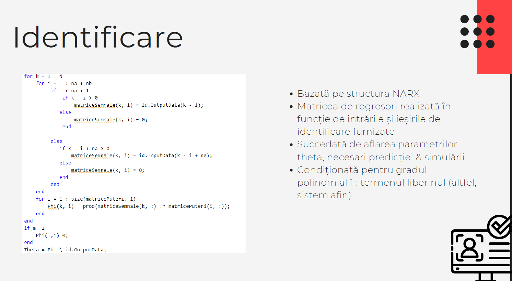

# System identification

This project is about a given dataset measured on an unknown dynamic system with one input and one output. We developed a black-box model for this system, using a nonlinear ARX structure. We used MATLAB to create polynomials in the previous inputs and outputs and identify the system.

Full documentation can be found in documentation.pdf

